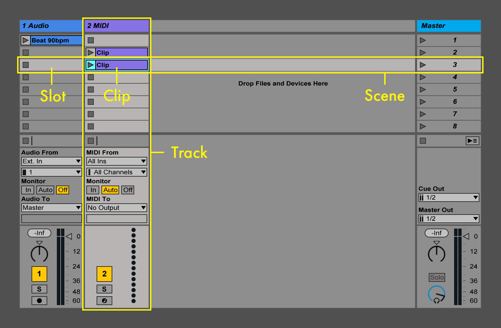

# Ableton Live Set Export

Ableton Live Set Export is a library that allows an application to write Ableton Live
project files. The library handles generation of the ALS document, but also creates the
project folder structure and copies any associated audio resources to the project. The
library provides an Objective-C wrapper for iOS development.

The library only contains functionality for generating Ableton Live projects. It does not
support reading or parsing Live Sets or other Ableton-generated files. This library also
does *not* handle transmitting the project data from an iOS device to Live, or any other
network operations. Ableton will provide separate UX guidelines to advise on how the
library can best be integrated in your app.

<a
 class="button"
 href="https://www.ableton.com/en/link/sdk/license-request/">
 Request Ableton Live Set Export
</a>

## Concepts and Terminology

* [Clip][live-manual-clips]: A clip is a single playable item, usually a MIDI sequence or
  audio file.
* [Label][live-manual-clip-labels]: A label contains a descriptive string and a color.
  They are one of Live's main tools for organizing content, and provide the user with an
  easy visual overview of a song. Several Live objects have labels, including clips,
  scenes, and tracks.
* [Live Set][live-manual-liveset]: An Ableton Live document (used interchangeably with
  "Song").
* [Project][live-manual-saving]: A project is a folder which contains one or more songs
  (ALS documents), along with their associated resources. Projects are, for the most part,
  self-contained but may contain external resources or platform-specific plugins and
  devices. However, projects generated by this library are always self-contained.
* [Scene][live-manual-scenes]: A scene is a row of clips in a Live Set. Scenes may be used
  to combine several related clips which are meant to be triggered together. Scenes are
  organized under the master track.
* Slot: A slot is a placeholder cell in a track which may contain a clip. If a slot does
  not have a clip, then it is empty and has a stop button (which also may be toggled).
  Triggering a stop button in an empty slot will stop playback of clips in the track.
* Song: An Ableton Live document (used interchageably with "Live Set").
* [Track][live-manual-tracks]: A track contains clips, and may play a single clip at a
  time. Tracks come in two varieties, audio or MIDI, and may only contain audio or MIDI
  clips, respectively.

## Creating a Live Set

The top-level class for creating Live Sets is the `Project`. A `Project` requires a
creator name, which should be the name of the application that writes the Live Set. This
string is also written to the song document itself.

The output of this library is a directory of files containing the Live Set and its
associated audio resources. For iOS, Ableton recommends zipping the file using a framework
such as [ZipArchive][ziparchive], and then using the system-provided sharing dialog to
export the `Project`.

### Song properties

Aside from the creator name (which is required), songs have some properties which can be
set:

* [Tempo][live-manual-tempo]: This is the tempo that will be used by Live when playing the
  song. Note that this tempo is independent of the tempo of audio clips in the song. Live
  uses a default value of 120 BPM for tempo, and is restricted to a range of 20-999 BPM.
* Time Signature: The global time signature does affect some playback properties, unlike
  clip time signature, which is for informational purposes only. The default tempo of a
  song is 4/4. Live imposes some restrictions on time signature as well (see the code
  documentation for more details), but all commonly-used time signatures are supported.

### Adding content to a song

After creating a project, either audio or MIDI tracks can be appended to it. A song must
have at least one track, or else cannot be written to disk. Tracks cannot be reordered,
they must be added to the song in the order which they should appear.

Once the song has some tracks, content may be added to them by adding clips. Unlike with
tracks, clips may be added to arbitrary indexes within a track. When the song is written,
any empty indexes will be populated with slots in all tracks.

For example, say that a song contains two tracks. A single clip is added to the first
track. The first track now has one clip, which means that it also has one scene. The
second track also has one scene with an empty slot, since all tracks must have the same
number of scenes. Now another clip is added to the second track at index 3. Now both
tracks have 4 scenes. The first track has a clip at index 0, and empty slots at indexes
1, 2, and 3, whereas the second track has empty slots at indexes 0, 1, and 2, and a clip
at index 3.

## Clip properties

After creating clips, their properties may be set to better suit the content which they
contain. To create useful Live Sets, your application should set as many clip properties
as it can, but any unset properties will use sane default values whenever possible.

### Common clip properties

Audio and MIDI clips differ slightly in their supported properties, but they share a few
common properties as well:

* Label: All [clips may have a label][live-manual-clip-labels]. When creating audio clips,
  the label's string will by default contain the associated file's base name. If a more
  appropriate user-facing description of the content is available, then it should be set
  to the clip's label. See also the "use of labels" section below.
* Time signature: The time signature of a clip is only used for informational purposes and
  does not effect clip playback.
* Looping: All clips can be looped, but by default this property is not set. In order for
  looped clips to work properly, Live must know their duration. For this reason, setting
  the correct duration on audio and MIDI clips is essential if they are to be looped. In
  the case of audio clips, warping must be enabled in order for them to be looped. Looping
  is disabled by default.

### Audio clip properties

* [Tempo][live-manual-warp-markers]: Audio clips in Live can be warped, which is a complex
  feature of Live that is covered in greater detail in the Ableton Live User Manual. For
  the purposes of this library, warping is only relevant in the context of looping, since
  audio clips must be warped in order to be played as loops. The library does not offer an
  API for the warping engine itself, but instead treats looped audio files as [straight
  loops][live-manual-straight-loops]. **This is important:** For audio files to be looped
  correctly, the tempo and duration properties must be set. Audio clips have a default
  tempo of 120 BPM.
* [Volume][live-manual-clip-gain]: This property refers to the volume level (gain), which
  is independent of the track volume.
* [Warp mode][live-manual-warp-mode]: The warp mode determines which timestretching
  algorithm is used to play back audio content. Using the correct warp modes can greatly
  improve Live's audio quality, especially if the global tempo and the clip tempo differ.
  If your application has a good idea about the nature of the audio content that it will
  synthesize, it might make sense to apply an appropriate warp mode to these clips. When
  in doubt, it is best to stick to the default warp mode, which will be set by Live based
  on the user's preferences. Also note that the "Complex" and "Complex Pro" warp modes are
  not supported by all editions of Live (see the "Live editions and restrictions" section
  below).

### MIDI clips

MIDI clips don't have any exclusive properties, but they can have any number of MIDI notes
in a sequence. Live does not represent MIDI clips as actual MIDI files, and furthermore,
this library does not expose all MIDI features which Live supports. Specifically, it only
supports MIDI note on and note off messages (with velocity).

The API for adding notes to a MIDI clip relies on some basic knowledge of the MIDI
protocol and how it represents note data. [A good MIDI reference can be found here]
[midi-reference].

## Use of labels

Live has several objects which can be labeled, including: clips, tracks, and scenes. Use
of labels is a good way to organize Live Sets, and users will appreciate if content from
the generating app has labels that they recognize. Specifically, if the app has text
descriptions for content, then these strings should be set on the labels of the Live
objects which they represent.

Each label may have an associated color as well. The label color feature should only be
used if the generating app also makes use of colors to organize content. The label API
has an enum with 10 common colors, and methods to find the nearest color given an RGB
triplet. Label colors remain the same regardless of which [skin][live-manual-skins] has
been selected by the user.

If your application does not use colors for organizational purposes, then it is best not
to set a color on the associated Live content. In this case, a random color will be chosen
for the object instead.

## Live editions and restrictions

There are four editions of Ableton Live: Lite, Intro, Standard, and Suite. The
[commercially available edition features can be found here][live-editions], and [the Live
Lite (OEM) features can be found here][live-lite-features].

The differences between the various editions of Live are quite many, but in terms of this
library, there are only a few key points to remember:

* Live Standard & Suite editions are exactly the same as far as this library is concerned.
  Both editions support all features in this library, and allow an unlimited number of
  tracks and scenes.
* Live Lite allows a maximum of 8 tracks (either audio or MIDI)
* Live Intro allows a maximum of 16 tracks (either audio or MIDI)
* Live Lite & Intro both allow a maximum of 8 scenes
* Live Lite & Intro do not support Complex or Complex Pro warp modes. Such clips will be
  re-warped with the "Beats" warp mode, and the user will see a warning dialog when the
  song is opened notifying them of this. Warp mode restrictions do not force Live to
  switch to demo mode.

In the case of the scene/track count restrictions, attempting to load a document which has
more content than the edition of Live permits will force Live into demo mode. In demo
mode, saving or exporting content is not allowed, even if the user deletes some of the
tracks or scenes to meet the restrictions. While this library does not impose a hard
restriction on scene or track counts, it is important for app makers to understand these
restrictions in case they want to warn Lite/Intro users about possibly incompatible Live
Sets.

### Live Lite compatibility

If your app is capable of generating more content than will fit in a Live Lite Set (8
tracks total, 8 scenes), then Ableton recommends creating two projects, one for each
edition. Adding "Lite" or "Full" to the end of the Project name provides a good user
experience, especially for Lite users.

Ableton suggests this practice so that Live Lite users do not try to open full sets with
their edition, which may result in an error dialog and user frustration.

### Live Lite distribution

If you are interested in [Live Lite][live-lite] distribution for your app, please contact
Ableton directly via <link-devs@ableton.com>. Live Lite distribution is only offered for
apps which integrate the Ableton Live Set Export library.

## iOS integration

For iOS apps, simply add the `libALSExportKit.a` library from the `lib` subdirectory of
the distribution zipfile to your project. You may also need to add the `include`
subdirectory to your project's list of header search paths in order to include the
`ALSExportKit.h` header file.

ALSExportKit depends on the following frameworks, which will need to be added to your
project settings:

 - AVFoundation
 - CoreMedia
 - Foundation
 - UiKit

## Promoting Ableton Export Integration

After investing the time and effort to add Ableton Export to your app, you will probably
want to tell the world about it. When you do so, please be sure to follow our [Ableton
Live Set Export promotion guidelines][export-promotion-pdf]. This document contains both
UI suggestions for integration and contains promotional guidelines and copy. Also
available are the following promotional [assets](assets):

 * [Ableton Live Set Export UI and Promotional Guidelines (PDF)][export-promotion-pdf]
 * [Ableton Live Set Export Marketing Photography (ZIP)][export-marketing-zip]
 * Ableton Live Set Export Badges, [White][export-badge-white] and [Black][export-badge-black]

You can also find further press kits in our [press area][ableton-press].

[ableton-press]: https://ableton.com/press
[export-badge-white]: https://ableton.github.io/export/assets/Ableton_Export_Badge-White.eps
[export-badge-black]: https://ableton.github.io/export/assets/Ableton_Export_Badge-Black.eps
[export-marketing-zip]: https://ableton.github.io/export/assets/Ableton_Live_Set_Export_Marketing.zip
[export-promotion-pdf]: https://ableton.github.io/export/assets/Ableton_Live_Set_Export_UI_and_Promotional_Guidelines.pdf
[live-editions]: https://www.ableton.com/en/live/feature-comparison/
[live-lite]: https://www.ableton.com/en/products/live-lite/
[live-lite-features]: https://www.ableton.com/en/products/live-lite/features/
[live-manual-clip-gain]: https://www.ableton.com/en/manual/clip-view/#clip-pitch-and-gain
[live-manual-clip-labels]: https://www.ableton.com/en/manual/clip-view/#clip-name-and-color
[live-manual-clips]: https://www.ableton.com/en/manual/live-concepts/#audio-and-midi
[live-manual-liveset]: https://www.ableton.com/en/manual/live-concepts/#live-sets
[live-manual-saving]: https://www.ableton.com/en/manual/live-concepts/#saving-and-exporting
[live-manual-scenes]: https://www.ableton.com/en/manual/session-view/#tracks-and-scenes
[live-manual-skins]: https://www.ableton.com/en/manual/first-steps/#setting-up-preferences
[live-manual-straight-loops]: https://www.ableton.com/en/manual/audio-clips-tempo-and-warping/#syncing-straight-loops
[live-manual-tempo]: https://www.ableton.com/en/manual/audio-clips-tempo-and-warping/#tempo
[live-manual-tracks]: https://www.ableton.com/en/manual/live-concepts/#tracks
[live-manual-warp-markers]: https://www.ableton.com/en/manual/audio-clips-tempo-and-warping/#warp-markers
[live-manual-warp-mode]: https://www.ableton.com/en/manual/audio-clips-tempo-and-warping/#adjusting-for-good-stretching-quality
[midi-reference]: http://midi.teragonaudio.com
[ziparchive]: https://github.com/ZipArchive/ZipArchive
