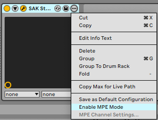
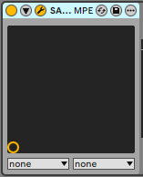
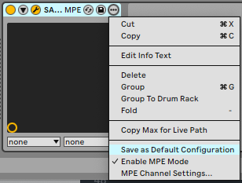
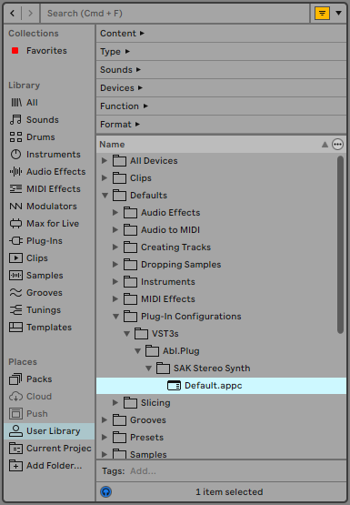

# Supporting MPE with plugins in Live

## Introduction

Live supports MPE since Live 11, including in plugin instruments. This document provides information about how MPE works in Live from the perspective of plugins and is aimed at plugin developers.

## MPE mode for plugins

In order to use MPE with a plugin in Live, the plugin must be in "MPE mode". This lets Live know that the plugin supports MPE and wants to receive MIDI input in MPE format. Concretely, having the plugin in MPE mode will cause three things to happen with regards to that plugin's MIDI input:

1. Each note will arrive on its own MIDI channel (as far as possible, given the current number of playing notes). Plugins not in MPE mode receive all notes from the track hosting the plugin on channel 0.
2. Per-note slide and pitch bend will arrive as MPE CC 74 and MPE pitch bend, respectively (i.e., they will arrive on the note channels). For plugins not in MPE mode, these parameters are filtered out and won't arrive at all.
3. Per-note pressure will arrive as MPE channel pressure (i.e., it will arrive on the note channels). For plugins not in MPE mode, this parameter will arrive as poly pressure on channel 0.

## Enabling MPE mode

MPE mode can be manually enabled or disabled by the user through Live's UI or as a user-configurable default. Plugins are also able to request it, either programmatically or by being added to a hard-coded list of plugins known by Live to want MPE input.

### Enabling MPE mode manually

The user is always able to manually enable or disable MPE mode for their plugins. This is done by selecting "Enable MPE Mode" from the plugin instance's context menu (reachable by clicking on the "..." button in the header part of the plugin instance's representation in Live's device chain):



This setting applies to the specific plugin instance. Note that the plugin instance's header displays the text "MPE" when the plugin is in MPE mode.



#### User-configurable default setting for MPE mode

The user can create a default for new instances of a given plugin by creating a default plugin configuration. This can be done by choosing "Save as Default Configuration" from the plugin instance's context menu:



Doing this creates a file in the user's library that encodes the plugin's current settings (including whether MPE mode is enabled) as the default for new instances of that plugin. The default configuration can be cleared by deleting that file, found in Live's browser in the User Library under `Defaults/Plug-In Configurations`:



### <a id="recognized-plugins"></a>Live's list of recognized plugins

Live includes a hard-coded list of plugins that are known to support MPE. Plugins on this list are automatically placed in MPE mode when instantiated (though the user's saved default configuration takes precedence, and the user can always override the setting manually).

If you are the author of an MPE-compatible plugin and want your plugin to be included on this list, please contact Ableton via [the third-party developer support form](https://help.ableton.com/hc/en-us/requests/new?ticket_form_id=360001694780). We will need to know the __exact name of the plugin on both MacOS and Windows (i.e., the name as it appears in Live's browser)__.

### Reporting plugin support for MPE via the plugin API

Some plugin APIs allow plugins to explicitly report that they support MPE and want to receive it. Live will query plugins on instantiation and will automatically place plugins that report themselves as MPE-compatible in MPE mode (though the user's saved default configuration takes precedence, and the user can always override the setting manually).

#### Audio Units

For AU plugins, Live queries the audio unit property `kAudioUnitProperty_SupportsMPE`. Plugins can indicate that they support MPE by returning `true` when this property is queried. See [Apple's documentation](https://developer.apple.com/documentation/audiotoolbox/kaudiounitproperty_supportsmpe) for details.

AUv3 plugins can control the value the host receives when querying this property by setting the property `supportsMPE` on the `AUAudioUnit`. See [Apple's documentation on this property](https://developer.apple.com/documentation/audiotoolbox/auaudiounit/1823489-supportsmpe?language=objc) for details.

#### VST2

For VST2 plugins, Live queries the plugin by invoking the opcode `effCanDo` via the plugin's dispatcher function with the query string `"MPE"`. Plugins can indicate that they support MPE by returning `true` when this capability is queried.

#### VST3

Unfortunately, unlike VST2, the VST3 API doesn't include a way for plugins to report that they support MPE. The only way for Live to automatically recognize a VST3 plugin as MPE-compatible is to have it [added to the list of recognized plugins](#recognized-plugins).

## Learning whether the plugin is currently in MPE mode

Live notifies plugins of whether they are in MPE mode by sending RPN 6, as suggested by the MPE spec (available [here](https://midi.org/midi-1-0) from the MIDI Association). If MPE mode is enabled, Live will send RPN 6 on either channel 0 or channel 15, depending on whether the upper or lower MPE zone is in use. The value of the RPN will be set to the number of channels in the zone.

Live normally uses the lower zone with channel 0 as the global channel and the remaining 15 channels in use as note channels, though this is configurable by the user. The upper and lower zones can't be used at the same time; only one is ever active at a given time.

If MPE mode was enabled but is later disabled by the user, then Live will indicate this by deactivating both the upper and lower zone.

### Example CC event sequences to indicate MPE mode and zone configuration

#### MPE mode active, default zone configuration

```
// Enable lower zone
Controller change: CC Num = 121   Val = 0   Chan = 0   // reset all controllers
Controller change: CC Num = 100   Val = 6   Chan = 0   // RPN LSB
Controller change: CC Num = 101   Val = 0   Chan = 0   // RPN MSB
Controller change: CC Num = 6     Val = 15  Chan = 0   // data entry
```

#### MPE mode active, upper zone in use, 8 note channels

```
// Enable upper zone
Controller change: CC Num = 121   Val = 0   Chan = 15  // reset all controllers
Controller change: CC Num = 100   Val = 6   Chan = 15  // RPN LSB
Controller change: CC Num = 101   Val = 0   Chan = 15  // RPN MSB
Controller change: CC Num = 6     Val = 8   Chan = 15  // data entry
```

#### MPE mode active, zone configuration changed

In this example, MPE mode is active on the plugin, and previously the default zone configuration was in use. Now, the user has just changed from the default zone configuration to one where the upper zone is in use, with 8 note channels.

```
// Disable lower zone
Controller change: CC Num = 121   Val = 0   Chan = 0   // reset all controllers
Controller change: CC Num = 100   Val = 6   Chan = 0   // RPN LSB
Controller change: CC Num = 101   Val = 0   Chan = 0   // RPN MSB
Controller change: CC Num = 6     Val = 0   Chan = 0   // data entry

// Enable upper zone
Controller change: CC Num = 121   Val = 0   Chan = 15  // reset all controllers
Controller change: CC Num = 100   Val = 6   Chan = 15  // RPN LSB
Controller change: CC Num = 101   Val = 0   Chan = 15  // RPN MSB
Controller change: CC Num = 6     Val = 8   Chan = 15  // data entry
```

#### MPE mode deactivated after previously active

In this example, MPE mode was active on the plugin. Now, the user has just manually disabled MPE mode via Live's UI.

```
// Disable lower zone
Controller change: CC Num = 121   Val = 0   Chan = 0   // reset all controllers
Controller change: CC Num = 100   Val = 6   Chan = 0   // RPN LSB
Controller change: CC Num = 101   Val = 0   Chan = 0   // RPN MSB
Controller change: CC Num = 6     Val = 0   Chan = 0   // data entry

// Disable upper zone
Controller change: CC Num = 121   Val = 0   Chan = 15  // reset all controllers
Controller change: CC Num = 100   Val = 6   Chan = 15  // RPN LSB
Controller change: CC Num = 101   Val = 0   Chan = 15  // RPN MSB
Controller change: CC Num = 6     Val = 0   Chan = 15  // data entry
```

***

[Back](index)
